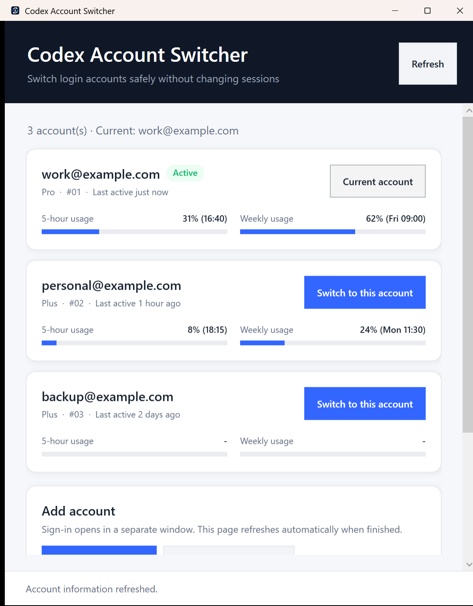

# Codex Account Switcher for Windows

A small Windows tray app for switching between Codex accounts without separating your local
sessions, settings, skills, or memories.

[](https://github.com/cguru/Codex-Account-Switcher-Windows/actions/workflows/build.yml)
[](LICENSE)

> Independent community project. Not affiliated with or supported by OpenAI.



## Features

- Switches the login account while preserving the same `%USERPROFILE%\.codex` session and settings directory.
- Closes the Codex desktop app before switching and relaunches it afterward.
- Uses [`codex-auth`](https://github.com/Loongphy/codex-auth) to save the current refreshed credentials before restoring the target account.
- Verifies the active email after every switch and attempts an automatic rollback if verification fails.
- Refuses to switch while a separate Codex CLI process is running.
- Runs in the Windows system tray and optionally starts with Windows.
- Supports Windows per-monitor DPI scaling and has been visually tested at 200% scaling.
- Automatically uses Korean on Korean Windows (`ko-*`) and English everywhere else.
- Uses local-only usage data by default. Live API usage lookup is explicit opt-in.
- Bundles a private portable Node.js runtime so live usage works without installing Node.js system-wide.

## Install

Download `CodexAccountSwitcher-Setup.exe` from the
[latest release](https://github.com/cguru/Codex-Account-Switcher-Windows/releases/latest) and run it.

- No administrator permission is required.
- The bundled installer includes the Windows x64 `codex-auth` runtime and portable Node.js.
- Desktop and Start menu shortcuts are created automatically.
- Closing the window keeps the app in the system tray; use **Quit** from the tray menu to exit.
- Silent installation is supported:

```powershell
CodexAccountSwitcher-Setup.exe --silent
```

The executable is currently unsigned, so Windows SmartScreen may show a warning on first launch.

## Add and switch accounts

1. Click **Sign in with browser** or **Sign in with device code**.
2. Complete the login in the separate terminal/browser flow.
3. Repeat for the second account.
4. Click **Switch to this account** on the account you want to use.

Accounts registered on macOS do not automatically appear on Windows. Register each account once
on every Windows machine where you use the switcher.

## Safety model

The switch flow is deliberately conservative:

1. Check that no external Codex CLI process is running.
2. Close the packaged Codex desktop app.
3. Ask `codex-auth` to sync the current credential state and switch by exact account email.
4. Read the local account list again and verify the target email is active.
5. If verification fails, switch back to the previous email when possible.
6. Relaunch Codex.

The app does not directly modify session, configuration, skill, or memory files. Authentication
tokens remain local. Enabling **Live usage lookup** allows the third-party `codex-auth` runtime to
call the OpenAI usage endpoint with the active token; the option is off by default.

## Build from source

Requirements:

- Windows 10 or 11 x64
- PowerShell 7 recommended
- Node.js 22+ and npm for source builds, used to obtain the pinned `codex-auth` installer payload
- .NET Framework 4.x compiler and WPF runtime included with Windows

```powershell
git clone https://github.com/cguru/Codex-Account-Switcher-Windows.git
cd Codex-Account-Switcher-Windows
.\build-installer.ps1
```

Output: `dist\CodexAccountSwitcher-Setup.exe`

Development checks:

```powershell
.\build.ps1
.\dist\CodexAccountSwitcher.exe --self-test --lang ko
.\dist\CodexAccountSwitcher.exe --self-test --lang en
.\dist\CodexAccountSwitcher.exe --demo --lang en
```

`--demo` displays fake accounts and never touches Codex processes or authentication files.

## Uninstall

Use **Settings → Apps → Installed apps → Codex Account Switcher**, or the uninstall shortcut in
the Start menu. Uninstalling the switcher does not delete Codex accounts or sessions.

## Third-party software

Release installers bundle `@loongphy/codex-auth` 0.2.10 and the official portable Node.js 24.18.1
runtime. See
[THIRD_PARTY_NOTICES.md](THIRD_PARTY_NOTICES.md) and
[vendor/LICENSE-codex-auth.txt](vendor/LICENSE-codex-auth.txt).

## License

[MIT](LICENSE) © 2026 cguru

---

## 한국어 안내

Codex의 로컬 세션과 설정은 그대로 유지하면서 로그인 계정만 바꾸는 Windows 트레이 앱입니다.

- 계정 전환 전에 Codex를 종료하고 완료 후 다시 실행합니다.
- 현재 갱신된 인증 정보를 먼저 보존한 다음 대상 계정으로 전환합니다.
- 전환 결과를 이메일로 재확인하고 실패하면 이전 계정으로 자동 복구를 시도합니다.
- Windows 표시 언어가 한국어면 전체 UI와 알림, 설치 화면이 한국어로 표시됩니다.
- 기본값은 로컬 사용량 정보만 읽으며 실시간 API 사용량 조회는 선택 사항입니다.
- 휴대용 Node.js 런타임이 설치 파일에 포함되어 별도 Node.js 설치 없이 실시간 조회가 동작합니다.

설치는 [최신 릴리스](https://github.com/cguru/Codex-Account-Switcher-Windows/releases/latest)에서
`CodexAccountSwitcher-Setup.exe` 하나만 내려받아 실행하면 됩니다. 관리자 권한은 필요하지 않습니다.

창의 X 버튼을 누르면 종료되지 않고 트레이로 숨습니다. 완전히 종료하려면 트레이 메뉴에서 **종료**를
선택하세요. 제거해도 Codex 계정과 세션 파일은 삭제되지 않습니다.
